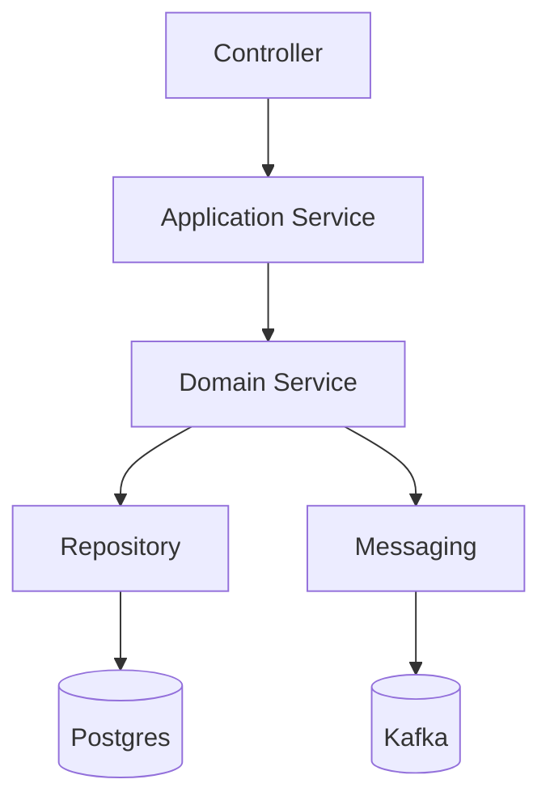

# 💳 Account Transfer API

API de transferência de contas construída em **Spring Boot**, seguindo princípios de **arquitetura limpa** e integrando com **Postgres** e **Kafka** via **Docker Compose**.

---
## 🗂 Arquitetura


## 📂 Estrutura de pacotes

Dentro de `src/main/java/com/account/transfer`:

```bash
account-transfer-api/
├── src/                        # Código Java organizado em pacotes
│   └── main/java/com/account/transfer
│       ├── application         # Casos de uso / lógica de aplicação
│       │   ├── controller      # Endpoints REST
│       │   └── dto             # Objetos de transferência de dados
│       ├── domain              # Regras de negócio
│       │   ├── model           # Entidades e agregados
│       │   └── service         # Serviços de domínio
│       ├── infrastructure      # Integrações externas
│       │   ├── repository      # Persistência (Postgres)
│       │   ├── messaging       # Comunicação via Kafka
│       │   └── config          # Configurações da aplicação
│       └── AccountTransferApiApplication.java
├── target/                     # Gerado pelo Maven
├── docker-compose.yml          # Configuração dos containers
├── data/                       # Dados persistentes do Postgres (volume Docker)
├── pom.xml                     # Dependências e build
├── mvnw / mvnw.cmd             # Maven Wrapper
└── .mvn/                       # Config do Maven Wrapper

```
🚀 Como rodar o projeto
1. Subir infraestrutura (Postgres + Kafka + Zookeeper)
Na raiz do projeto:
```
docker-compose up -d
```
Isso cria:
- Postgres → localhost:5432  
- Usuário: postgres | Senha: postgres | Banco: accountdb
- Kafka → localhost:9092
- Zookeeper → localhost:2181

Os dados do Postgres ficam em data/ (já ignorada no .gitignore).

2. Rodar a aplicação
Com Maven Wrapper:
```
./mvnw spring-boot:run
```
No Windows PowerShell:
```
mvnw.cmd spring-boot:run
```
3. Acessar a API
Por padrão, a aplicação sobe em:
```
http://localhost:8080
```
Se configurado o Swagger/OpenAPI:
```
http://localhost:8080/swagger-ui.html
```
🧪 Testes
Para rodar os testes
```
./mvnw test
```
📌 Observações
O banco de dados é persistido em data/, mas essa pasta está no .gitignore para não poluir o repositório.

A arquitetura segue separação clara entre application, domain e infrastructure.

O ambiente pode ser resetado com:
```
docker-compose down -v
```


